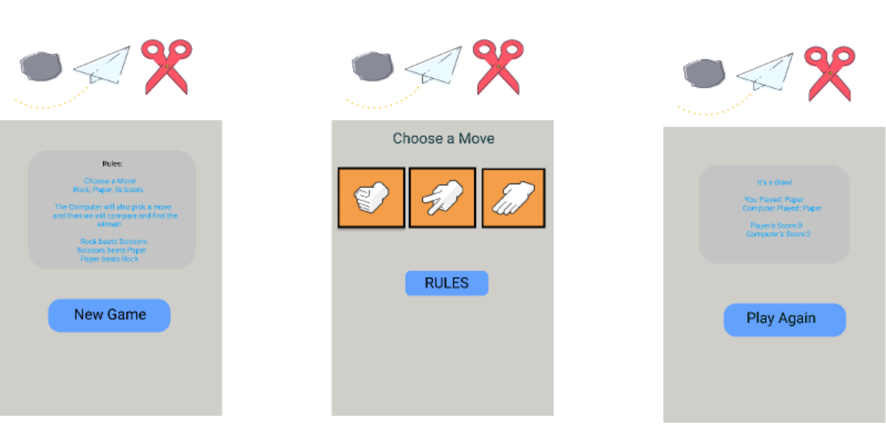

# Rock Paper Scissors (Pokemon Remix)

## Background

- Game Choice: Rock Paper Scissors
  I wanted to make this game for personalized and unique, so I am adding the twist of using Pokemon Types instead of rock paper scissors.

## Wireframe



### PseudoCode

```
    function makeChoice(choice){
        - grab choice data from button user presses
        - store the data in a variable representing each player's choices
    }

    function checkChoices(p1Choice, p2Choice) {
        - compare both player's choices
        - if (player 1 choice beats player 2) {
            - player 1 gets point
        } else if (p2 choice beats p1) {
            - player 2 gets point
        }
        else  {
            both players get point
        }
    }

    function determineWinner(p1Score, p2Score) {
        if (p1Score > p2Score) {
            p1 wins game
        } else if (p2Score > p1Score) {
            p2 wins game
        } else {
            its a tie
        }
    }
```
